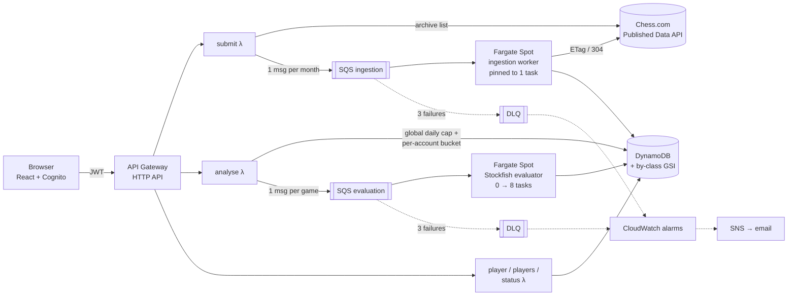

# chess-cloud

**Live: [chess.hoowenkang.com](https://chess.hoowenkang.com)**

**Chess.com Insights, rebuilt as a distributed system on AWS.** Enter a Chess.com username; the system pulls the player's entire game history, runs Stockfish over their recent games, and shows where their mistakes actually happen.

The chess is the payload. The point is the system around it: a job queue with at-least-once delivery, scale-to-zero workers, an upstream API that must never see parallel requests, and a monthly bill measured in cents. Everything is Terraform, deployed by GitHub Actions with no long-lived AWS keys.

---

## What it does

1. **Ingest.** A username resolves to every monthly archive the player has — 230 for a long-lived account — and each month becomes one queue message. A worker fetches them one at a time from Chess.com's public API, caching by ETag, and stores each game.
2. **Evaluate.** On request, the newest 100 games per time control are fanned out to a second queue, where up to eight Fargate tasks run Stockfish at depth 18.
3. **Show.** Per player: accuracy (average centipawn loss), blunders per game, and *where in a game* the mistakes happen, bucketed by percentage of the game rather than move number.

## Architecture



| Layer | What's used | Why this and not the obvious alternative |
|---|---|---|
| API | API Gateway HTTP API, 5 Python Lambdas, Cognito JWT authorizer | Reads are public; only the routes that spend money need a token |
| Work | SQS + ECS Fargate Spot, two services | Stockfish is CPU-bound and wants a warm engine process — the rare case where "why not Lambda" has a real answer. Spot is ~70% off, and the queue makes an interruption free |
| Data | DynamoDB, single table, one sparse GSI | Fixed access patterns make DynamoDB the *better* answer, not just the cheaper one — no joins, no ad-hoc queries |
| Network | Custom VPC, public subnets, no-ingress security group, free gateway endpoints | Private subnets would cost a ~$32/month NAT (16× the budget) to protect tasks nothing can already reach |
| Ops | JSON logs with request IDs, a metric filter, alarms → SNS, X-Ray on the Lambdas, a drift check | Each one answers a named question; there is deliberately no dashboard |
| Frontend | React on GitHub Pages, DNS in a Route 53 hosted zone | Built for S3 + CloudFront + ACM, which are written and wait on AWS verifying the account (see Limits) |
| Delivery | Terraform (10 roots), GitHub Actions with OIDC federation | No AWS credential exists in GitHub |

## Numbers

All measured on the live system, not estimated.

| | |
|---|---|
| Games stored | **83,000+** across players; one player alone has 70,344 |
| Cost to fully evaluate a player | **~$0.10** worst case (300 games) — re-measured against the actual bill, which corrected an earlier estimate that was 2× too low |
| Re-checking an unchanged month | **304, 0 bytes, 0.15 s** vs 200, 3.4 MB, 0.81 s — **155× cheaper**, which is what makes a duplicate delivery nearly free |
| Resolving and queueing a 230-month player | **9.4 s** |
| Parallel evaluation | 8 tasks, **6.7× speed-up** |
| `/player` for the largest player | **~23 s → 0.5 s** after adding a sparse GSI (found with X-Ray) |
| Monthly running cost | **Cents** at personal scale. Nothing bills while idle: both services scale to zero, and there is no NAT, ALB or RDS |
| Worst-case abuse | **~$1/day**, bounded by a global daily cap on games — however many accounts exist |

## Decisions worth asking about

Each of these has a longer write-up, with the alternative that was rejected, in the phase files below.

- **Ingestion is pinned to one task, on purpose.** Chess.com permits serial access and may 429 parallel requests — per *caller*, not per player. Scaling the worker out is the one optimisation that could get the IP banned, and a ban is the one failure money cannot fix. 230 consecutive fetches returned zero 429s.
- **Idempotency is free because nothing accumulates.** SQS delivers at least once. Each month's aggregate is *recomputed* from the archive and written in a single `UpdateItem`, so a duplicate overwrites identical values — and, because the first delivery stored an ETag, the duplicate is the cheap 304 path.
- **Bound the games, not the depth.** Shallow Stockfish looked like the obvious cost lever. Benchmarked over 1,047 real positions, depth 8 finds only 53% of blunders and halves the headline accuracy figure. So the depth stays at 18 and the *game count* is bounded instead — which also makes a 70,000-game player cost the same as anyone else.
- **One queue message per game, one message per receive.** Batching ten slow games overran the visibility timeout, and the tail was evaluated twice (236 evaluations for 200 games). Request IDs threaded through the queue are what made that countable.
- **Derive on read; store only what one writer owns.** Progress counters would be incremented by up to eight evaluators at once. Instead, progress is computed from the game items on read — so it cannot drift.
- **Cut what has no failure mode here.** S3 uploads, account verification, private subnets, a dashboard and a spending stop were all planned and all cut, each with a written reason. (The spending stop came back later as a daily cap, once evaluation made it necessary.) Account linking — Lichess OAuth with PKCE — was *built*, then removed once verification was cut and nothing depended on it.

## Operations

- **Alerts that have been seen to fire.** Both dead-letter queues and an account-wide Lambda-errors alarm email through SNS. Each was drilled — the DLQ with a poison message sent through the real path — and the Lambda alarm later caught an unstaged outage **17 seconds** after it began.
- **Structured logs, end to end.** The Lambda's request ID rides in every queue message, so one query finds every line a request produced across both services.
- **A drift check** asserts the invariants a Terraform plan cannot see as wrong: scale-to-zero, ingestion pinned to one task, services in the right VPC, no inbound rules, an intact alert path, and exact trust policies on the CI roles. It runs after every deploy.

## Deployment

```
PR ─► checks (compile, selection test) ─► plan every root, posted on the PR
merge ─► checks ─► build worker image, tagged with the git SHA
       ─► apply 7 roots in dependency order ─► smoke test ─► drift check
```

- **OIDC federation, no keys.** GitHub signs a token per run; AWS exchanges it for credentials that expire within the hour. A read-only role plans pull requests; only `main` can assume the apply role. Drilled: a branch push is refused both roles.
- **The worker image names its code.** It is tagged with the git SHA and deployed by Terraform, with every dependency pinned down to Stockfish's Debian version — so a rebuild cannot silently change an evaluation.
- **Failure behaviour, drilled.** A red check skips the apply entirely. An apply that fails partway stops at that root, and a revert converges. Two pushes never apply at once.

## Repository

```
app/handlers/     Lambda handlers (Python 3.13, stdlib + boto3)
app/worker/       Ingestion worker and Stockfish evaluator (one image)
terraform/        9 roots: bootstrap, ci, guardrails, network, data, queue, auth, worker, api
web/              React + TypeScript + Vite frontend, Cognito sign-in
tests/            The one test that exists — see why in PHASE-5
scripts/          Drift check, one-off migrations and backfills
.github/          Plan, apply and checks workflows
```

## How it was built

In phases, each with its decisions, rejected alternatives, and failure drills written down as it happened. The reasoning lives there, not in this README.

| Phase | Subject |
|---|---|
| [1](PHASE-1.md) | API Gateway, Lambda, DynamoDB, budget guardrails — Terraform from the first commit |
| [2](PHASE-2.md) | Cognito, least-privilege IAM, chess account linking |
| [3](PHASE-3.md) | Archive ingestion: fan-out, SQS, Fargate, DLQ, ETag caching, idempotency |
| [F](PHASE-F.md) | The frontend |
| [E](PHASE-E.md) | Stockfish: a second queue and service, per-game storage, rate limiting |
| [6](PHASE-6.md) | A purpose-built VPC, and why it has no private subnets |
| [4](PHASE-4.md) | Observability: structured logs, request IDs, alarms that fire, X-Ray |
| [5](PHASE-5.md) | CI/CD with OIDC federation |

## Limits, stated

- **The frontend is outside AWS for now.** The account is unverified, so AWS refused both the domain registration and the CloudFront distribution. The domain is registered at Porkbun with its DNS in Route 53, and GitHub Pages serves the app. The S3 bucket and ACM certificate exist, and one Terraform variable switches to CloudFront once AWS verifies the account.
- **Chess.com only.** Lichess has no archive-list endpoint to walk, so ingesting it would be a different design.
- **Horizontal ingestion scaling is unresolved, not unbuilt.** It waits on confirming Chess.com's real limit, not on a mechanism.
- **Scale-to-zero costs latency.** SQS metrics lag ~5 minutes, so the first task can take 1–5 minutes to start. That is the accepted price of a near-zero bill.
